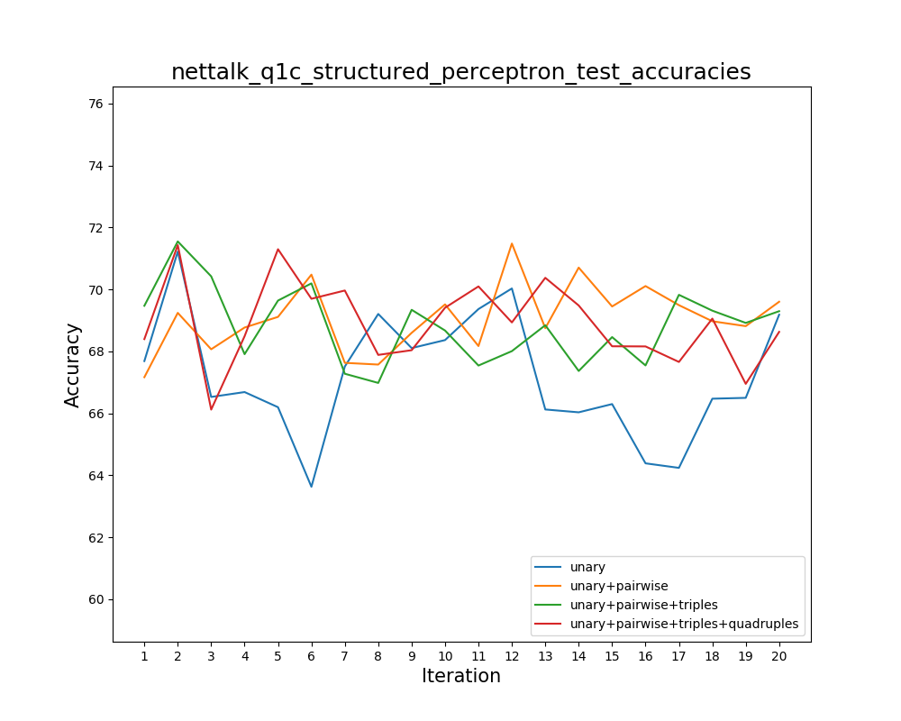
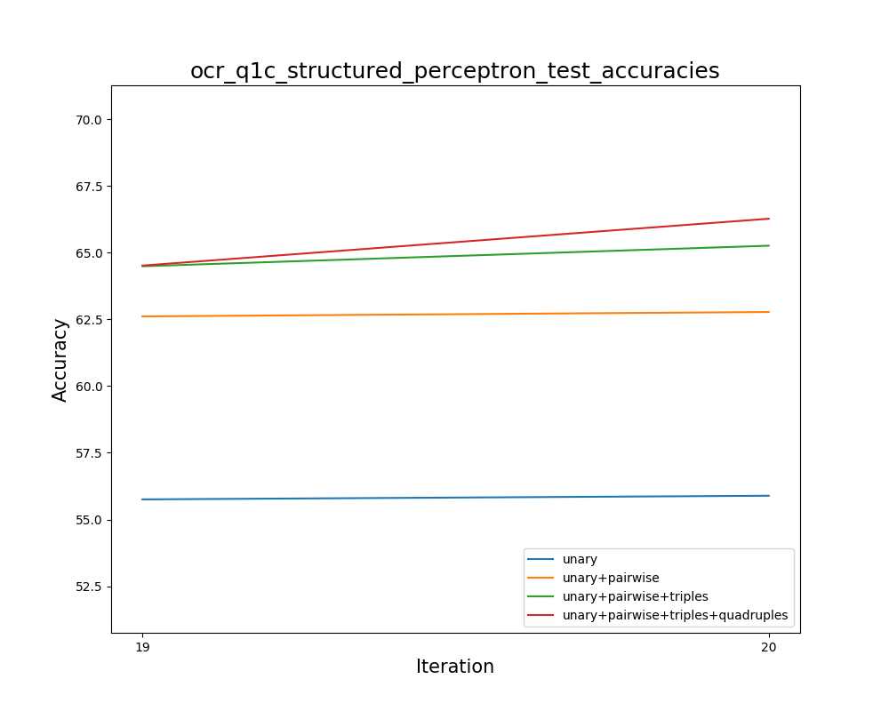
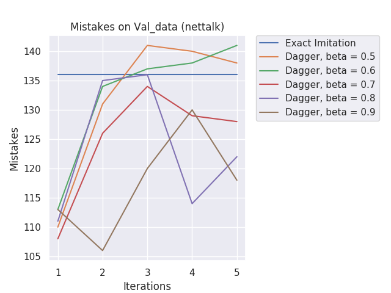
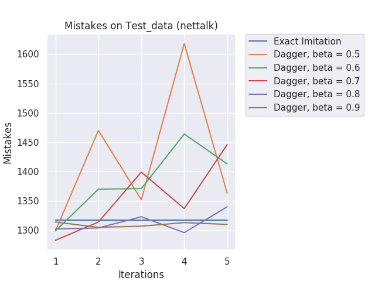
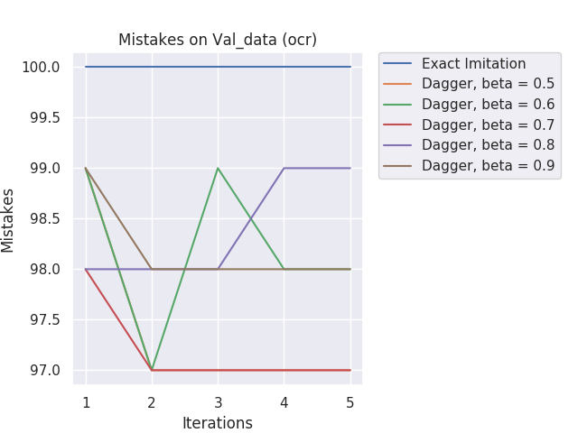
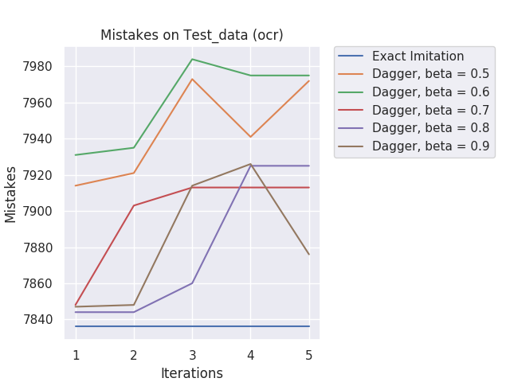

# Structured-Prediction-and-Intelligent-Decision-Making

## Structured Prediction

[Solution explanation for Structured Perceptron](structured_perceptron/hw1-Soln.pdf)

## DAgger Imitation Learning

[Solution explanation for DAgger](DAgger_imitationLearning/Structured_Prediction_Homework_Assignment_2.pdf)

